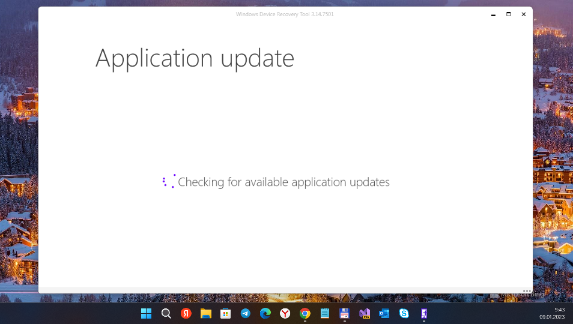

# WDRT 

Windows Device Recovery Tool Components Decompiled

## Abstract

Decompiled dotnet source for Windows Device Recovery Tool, this code is provided 'as-is' and produced with "dnSpy", so expect errors in places.

# Design / Screenshots
<table><tr>
<td>  </td>
</tr></table>

## My 2 cents
- All projects "assembled" to one solution (.sln)


## "Architecture" ("Files decompiled")

```
en\System.Windows.Interactivity.resources
en-GB\Microsoft.WindowsDeviceRecoveryTool.Localization.resources
FFUComponents
HoloLensClickerUtilityLibrary
ImageCommon
ImageSigner
Microsoft.Azure.KeyVault.Core
Microsoft.Data.Edm
Microsoft.Data.OData
Microsoft.Data.Services.Client
Microsoft.Diagnostics.Tracing.EventSource
Microsoft.Tools.Connectivity
Microsoft.Tools.DeviceUpdate.DeviceUtils
Microsoft.WindowsAzure.Storage
Microsoft.WindowsDeviceRecoveryTool.AcerAdaptation
Microsoft.WindowsDeviceRecoveryTool.AlcatelAdaptation
Microsoft.WindowsDeviceRecoveryTool.AnalogAdaptation
Microsoft.WindowsDeviceRecoveryTool.BluAdaptation
Microsoft.WindowsDeviceRecoveryTool.BusinessLogic
Microsoft.WindowsDeviceRecoveryTool.Common
Microsoft.WindowsDeviceRecoveryTool.Core
Microsoft.WindowsDeviceRecoveryTool.DiginnosAdaptation
Microsoft.WindowsDeviceRecoveryTool.FawkesAdaptation
Microsoft.WindowsDeviceRecoveryTool.Ffu
Microsoft.WindowsDeviceRecoveryTool.FfuFileReader
Microsoft.WindowsDeviceRecoveryTool.FreetelAdaptation
Microsoft.WindowsDeviceRecoveryTool.HoneywellAdaptation
Microsoft.WindowsDeviceRecoveryTool.HPAdaptation
Microsoft.WindowsDeviceRecoveryTool.HtcAdaptation
Microsoft.WindowsDeviceRecoveryTool.InversenetAdaptation
Microsoft.WindowsDeviceRecoveryTool.JenesisAdaptation
Microsoft.WindowsDeviceRecoveryTool.KMAdaptation
Microsoft.WindowsDeviceRecoveryTool.LenovoAdaptation
Microsoft.WindowsDeviceRecoveryTool.LgeAdaptation
Microsoft.WindowsDeviceRecoveryTool.Localization
Microsoft.WindowsDeviceRecoveryTool.LogicCommon
Microsoft.WindowsDeviceRecoveryTool.Lucid
Microsoft.WindowsDeviceRecoveryTool.LumiaAdaptation
Microsoft.WindowsDeviceRecoveryTool.McjAdaptation
Microsoft.WindowsDeviceRecoveryTool.MicromaxAdaptation
Microsoft.WindowsDeviceRecoveryTool.Model
Microsoft.WindowsDeviceRecoveryTool.OemAdaptation
Microsoft.WindowsDeviceRecoveryTool.StateMachine
Microsoft.WindowsDeviceRecoveryTool.Styles
Microsoft.WindowsDeviceRecoveryTool.TrekStorAdaptation
Microsoft.WindowsDeviceRecoveryTool.TrinityAdaptation
Microsoft.WindowsDeviceRecoveryTool.UnistrongAdaptation
Microsoft.WindowsDeviceRecoveryTool.VAIOAdaptation
Microsoft.WindowsDeviceRecoveryTool.WileyfoxAdaptation
Microsoft.WindowsDeviceRecoveryTool.XOLOAdaptation
Microsoft.WindowsDeviceRecoveryTool.YEZZAdaptation
Microsoft.WindowsDeviceRecoveryTool.ZebraAdaptation
Newtonsoft.Json
Nokia.Lucid
Nokia.Lucid.GenericStream
Nokia.Lucid.IsiStream
Nokia.Mira
PresentationFramework
SirepInterop
SoftwareRepository
System.Drawing
System.Management
System.Spatial
System.Windows.Forms
System.Windows.Interactivity
ToolsCommon
ufphostm
WindowsDeviceRecoveryTool
ZipForge
```

## CAUTION

- As my other decomp tests, this is as-is, I will not edit these. They are just a template for me to learn and maybe others.


## TODO
- Try to reconstruct this solution... (or find the time for WDRT RnD, heh)

## References
https://github.com/Empyreal96/WindowsDeviceRecoveryTool_components_decompiled

https://github.com/microsoft


## ..
AS IS. No support. RnD only / DIY

## .
[m][e] 2022


